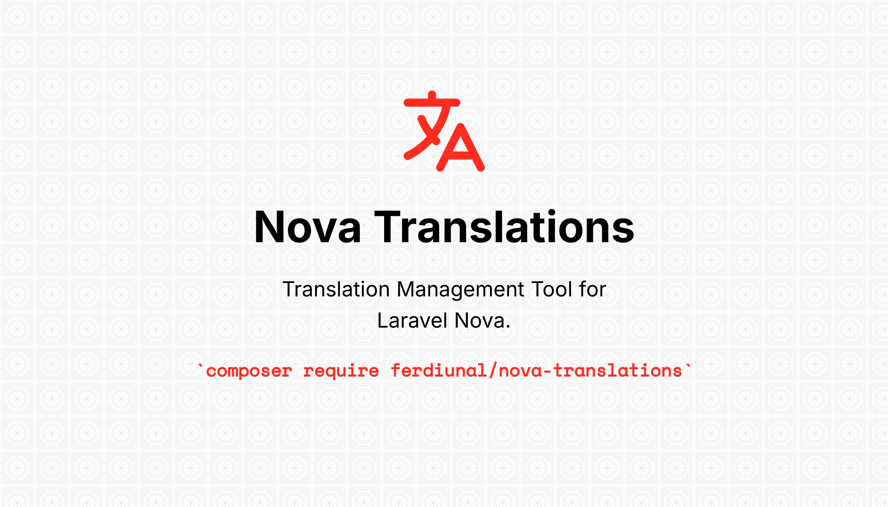

# Nova Translations - WIP


This package allows you to find and manage the translation keys and language files in your project using the **[spatie/laravel-translation-loader](https://github.com/spatie/laravel-translation-loader)** package. By default, it includes free translation tools like **Google Translate**, **Bing Translate**, and **MyMemory Translate**, as well as paid tools that offer a certain amount of free usage, such as **DeepL Translate** and **NLPCloud Translate**. You can also add other translation tools as shown in the example below.

## Installation

To install, run the following command in your project directory:

```bash
composer require ferdiunal/nova-translations
```
## Configuration

Optionally, you can publish the migration file using this command:

```bash
php artisan vendor:publish --tag nova-translations-migrations
```

Optionally, you can publish the configuration file using this command:
```bash
php artisan vendor:publish --tag nova-translations-config
```

## Usage

To import the translation keys and language files used in your project into a table, you can run the following command. You can use the -T|--translater parameter to specify the supported translation tools for this process.

```bash
php artisan nova-translations:import --help
Description:
  Import translations from the language files

Usage:
  nova-translation:import [options]

Options:
  -T, --translater[=TRANSLATER]  The translater to use: google,bing,deepl,mymemory,nlpcloud
  -h, --help                     Display help for the given command. When no command is given display help for the list command
  -q, --quiet                    Do not output any message
  -V, --version                  Display this application version
      --ansi|--no-ansi           Force (or disable --no-ansi) ANSI output
  -n, --no-interaction           Do not ask any interactive question
      --env[=ENV]                The environment the command should run under
  -v|vv|vvv, --verbose           Increase the verbosity of messages: 1 for normal output, 2 for more verbose output and 3 for debug
```

Then, update the tools method in the app/NovaServiceProvider file as follows:

```php 
// app/NovaServiceProvider.php
class NovaServiceProvider extends NovaApplicationServiceProvider
{ 
    /**
     * Get the tools that should be listed in the Nova sidebar.
     *
     * @return array
     */
    public function tools()
    {
        return [
            ... // Other Nova Tools
            new NovaTranslations,
        ];
    }
}

```

## Translators

### Google Translate

If you want to use Google Translate in your project, you need to add the following package:

```bash
composer require stichoza/google-translate-php
```

### DeepL Translate

If you want to use DeepL Translate in your project, you need to add the following package:

```bash
composer require deeplcom/deepl-php
```

Then, add the following key to your environment file:
```
DEEPL_API_KEY=xxxxxxxx...
```

### NLPCloud Translate

If you want to use NLP Translate in your project, you need to add the following package:

```bash
composer require nlpcloud/nlpcloud-client
```

Then, add the following key to your environment file:

```
NLPCLOUD_API_KEY=xxxxxxxx
```

For different languages, you need to add the required language code to the config/nova-translations configuration file from [here](https://docs.nlpcloud.com/#translation).

```php
return [
    ....
    'services' => [
        'nlpcloud' => [
            // https://nlpcloud.com/
            'api_key' => env('NLPCLOUD_API_KEY'),
            'languages' => [
                // https://docs.nlpcloud.com/#translation
                // Add the language code you want here
            ],
        ],
    ],
];
```

## OTHER NOVA PACKAGES

* [Nova Settings](https://github.com/ferdiunal/nova-settings)

    This package provides an interface for Spatie's settings package in Laravel Nova. It allows you to easily manage your application's configuration settings.
* [Laravel Nova Media Field](https://github.com/ferdiunal/laravel-nova-media-field)

    This package integrates Spatie's Media Library package with Laravel Nova, allowing you to manage and organize your media files efficiently.
* [Nova Password Confirm Modal](https://github.com/ferdiunal/nova-password-confirm-modal)
    
    This package provides a Nova field that controls the accessibility of encrypted data in the database and is managed by model casts. It ensures that your sensitive data is securely stored.

## Contributing

Contributions are welcome, and any contributors must adhere to the project's code of conduct and licensing terms.

## Support

For support, please open an issue in the GitHub repository.


## Licence 

This project is open-sourced software licensed under the [MIT license](LICENSE).
